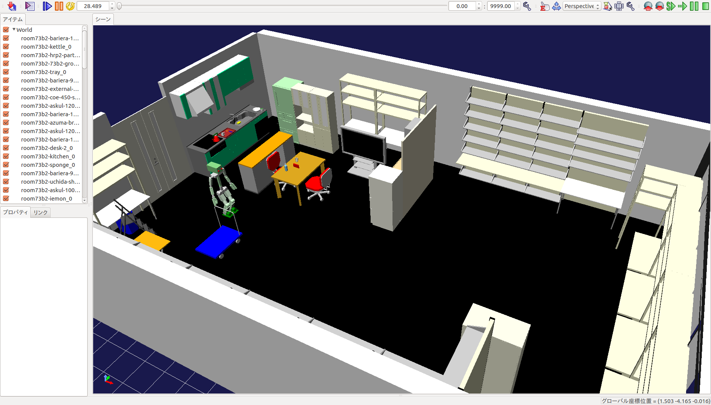

# eusurdfwrl



## How to Build

First, install simtrans
```
cd /tmp
git clone https://github.com/fkanehiro/simtrans
cd simtrans
sudo pip install -r requirements.txt
sudo python setup.py install
```

Then, build eusurdfwrl
```
cd catkin_ws
rosdep install -r --from-paths src --ignore-src -y
catkin build eusurdfwrl
```

## How to use

```
rtmlaunch hrpsys_choreonoid_tutorials jaxon_red_choreonoid.launch LOAD_OBJECTS:=true ENVIRONMENT_YAML:=`rospack find eusurdfwrl`/worlds/room73b2.yaml
```
原点にドアがあるため、ロボットの初期位置をずらしておく必要がある

## Conversion

`eusurdf/models/*/model.urdf` -> `eusurdfwrl/models/*.wrl`

`eusurdf/worlds/*.world` -> `eusurdfwrl/worlds/*.yaml` (loadable by `hrpsys_choreonoid/launch/add_objects.py`)